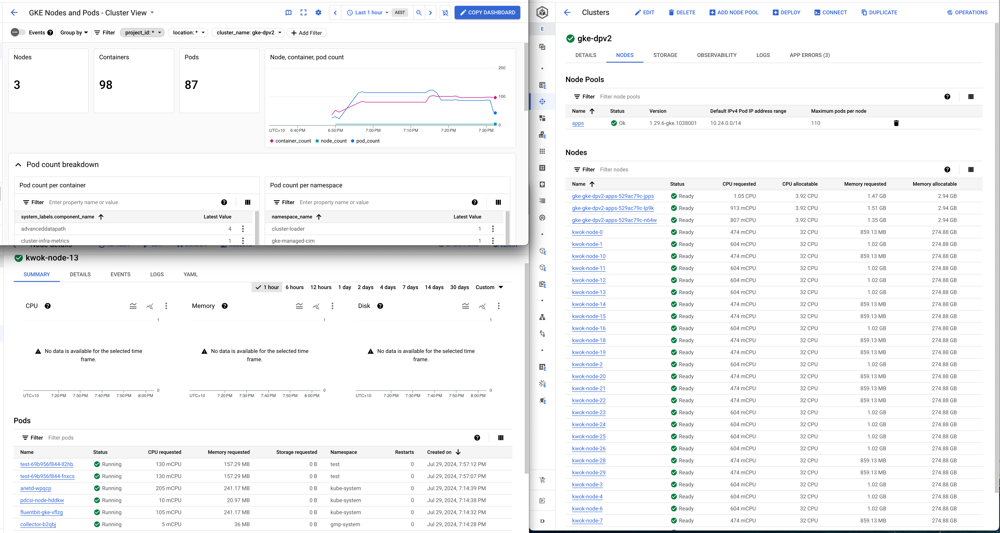

# Kwok

Start KWOK control plane in a separate terminal:

```sh
$ ./kwok-control-plane.sh
```

Generate nodes:
```sh
$ ./kwok-create-nodes.sh
```

Daemonsets are automatically fitted into fake nodes. Any deploymen can be adjusted to "schedule" on these nodes by either adding a toleration or removing a taint from the nodes.
```yaml
      tolerations:
      - effect: NoSchedule
        key: kwok.x-k8s.io/node
        operator: Exists
```

They appear as usual nodes/pods when quierried from API server. Obviously they don't send valid metrics so they are invisible to dashboards:



# ClusterLoader2

clone repo and build clusterloader binary

```sh
$ git clone git@github.com:kubernetes/perf-tests.git
$ cd perf-tests/cmd
$ CGO_ENABLED=0 go build -o cl2 './cmd'
```

And move it somewhere in the $PATH

```sh
$ cl2 --testconfig=2024.07-kwok-and-load-test/cl2-sample-config.yaml --kubeconfig=$KUBECONFIG --provider=gke --v=2
```

Some samples from output:
```
I0729 19:29:35.711147   27226 framework.go:276] Applying templates for "manifest/exec_deployment.yaml"
I0729 19:29:35.711220   27226 framework.go:287] Applying manifest/exec_deployment.yaml
I0729 19:29:35.865457   27226 wait_for_pods.go:64] Exec service: namespace(cluster-loader), labelSelector(feature = exec): starting with timeout: 1m59.947819083s
I0729 19:29:45.867543   27226 wait_for_pods.go:122] Exec service: namespace(cluster-loader), labelSelector(feature = exec): Pods: 3 out of 3 created, 3 running (3 updated), 0 pending scheduled, 0 not scheduled, 0 inactive, 0 terminating, 0 unknown, 0 runningButNotReady
I0729 19:29:45.867729   27226 exec_service.go:115] Exec service: service set up successfully!
W0729 19:29:45.868247   27226 imagepreload.go:92] No images specified. Skipping image preloading
I0729 19:29:45.873414   27226 clusterloader.go:449] Test config successfully dumped to: generatedConfig_test.yaml
I0729 19:29:45.873434   27226 clusterloader.go:238] --------------------------------------------------------------------------------
I0729 19:29:45.873440   27226 clusterloader.go:239] Running 2024.07-kwok-and-load-test/cl2-sample-config.yaml
I0729 19:29:45.873445   27226 clusterloader.go:240] --------------------------------------------------------------------------------
I0729 19:29:45.873919   27226 simple_test_executor.go:58] AutomanagedNamespacePrefix: test-2wuaym
...
I0729 19:29:52.516477   27226 phase_latency.go:146] PodStartupLatency: perc50: 3.368478s, perc90: 3.38202s, perc99: 3.405402s; threshold 20s
I0729 19:29:52.516489   27226 phase_latency.go:141] PodStartupLatency: 10 worst create_to_schedule latencies: [{test-2wuaym-1/test-deployment-0-6b699fc7cb-9pgxb 0s} {test-2wuaym-1/test-deployment-0-6b699fc7cb-qnm54 0s} {test-2wuaym-1/test-deployment-0-6b699fc7cb-7wx44 0s} {test-2wuaym-1/test-deployment-0-6b699fc7cb-99mms 0s} {test-2wuaym-1/tes
t-deployment-0-6b699fc7cb-b7nmb 0s} {test-2wuaym-1/test-deployment-0-6b699fc7cb-fbtkm 0s} {test-2wuaym-1/test-deployment-0-6b699fc7cb-d75p7 0s} {test-2wuaym-1/test-deployment-0-6b699fc7cb-5d5tc 0s} {test-2wuaym-1/test-deployment-0-6b699fc7cb-jr77s 0s} {test-2wuaym-1/test-deployment-0-6b699fc7cb-5sngx 0s}]
I0729 19:29:52.516503   27226 phase_latency.go:146] PodStartupLatency: perc50: 0s, perc90: 0s, perc99: 0s
I0729 19:29:52.516512   27226 phase_latency.go:141] PodStartupLatency: 10 worst schedule_to_run latencies: [{test-2wuaym-1/test-deployment-0-6b699fc7cb-99mms 2s} {test-2wuaym-1/test-deployment-0-6b699fc7cb-b7nmb 2s} {test-2wuaym-1/test-deployment-0-6b699fc7cb-9pgxb 2s} {test-2wuaym-1/test-deployment-0-6b699fc7cb-qnm54 2s} {test-2wuaym-1/test-d
eployment-0-6b699fc7cb-7wx44 2s} {test-2wuaym-1/test-deployment-0-6b699fc7cb-jr77s 2s} {test-2wuaym-1/test-deployment-0-6b699fc7cb-5sngx 2s} {test-2wuaym-1/test-deployment-0-6b699fc7cb-fbtkm 2s} {test-2wuaym-1/test-deployment-0-6b699fc7cb-d75p7 2s} {test-2wuaym-1/test-deployment-0-6b699fc7cb-5d5tc 2s}]
I0729 19:29:52.516682   27226 phase_latency.go:146] PodStartupLatency: perc50: 2s, perc90: 2s, perc99: 2s
I0729 19:29:52.516704   27226 phase_latency.go:141] PodStartupLatency: 10 worst run_to_watch latencies: [{test-2wuaym-1/test-deployment-0-6b699fc7cb-fbtkm 602.367ms} {test-2wuaym-1/test-deployment-0-6b699fc7cb-9pgxb 626.701ms} {test-2wuaym-1/test-deployment-0-6b699fc7cb-d75p7 641.564ms} {test-2wuaym-1/test-deployment-0-6b699fc7cb-5d5tc 1.36800
8s} {test-2wuaym-1/test-deployment-0-6b699fc7cb-qnm54 1.368478s} {test-2wuaym-1/test-deployment-0-6b699fc7cb-7wx44 1.374463s} {test-2wuaym-1/test-deployment-0-6b699fc7cb-jr77s 1.37618s} {test-2wuaym-1/test-deployment-0-6b699fc7cb-5sngx 1.378102s} {test-2wuaym-1/test-deployment-0-6b699fc7cb-99mms 1.38202s} {test-2wuaym-1/test-deployment-0-6b699
fc7cb-b7nmb 1.405402s}]
I0729 19:29:52.516833   27226 phase_latency.go:146] PodStartupLatency: perc50: 1.368478s, perc90: 1.38202s, perc99: 1.405402s
I0729 19:29:52.516849   27226 phase_latency.go:141] PodStartupLatency: 10 worst schedule_to_watch latencies: [{test-2wuaym-1/test-deployment-0-6b699fc7cb-fbtkm 2.602367s} {test-2wuaym-1/test-deployment-0-6b699fc7cb-9pgxb 2.626701s} {test-2wuaym-1/test-deployment-0-6b699fc7cb-d75p7 2.641564s} {test-2wuaym-1/test-deployment-0-6b699fc7cb-5d5tc 3.
368008s} {test-2wuaym-1/test-deployment-0-6b699fc7cb-qnm54 3.368478s} {test-2wuaym-1/test-deployment-0-6b699fc7cb-7wx44 3.374463s} {test-2wuaym-1/test-deployment-0-6b699fc7cb-jr77s 3.37618s} {test-2wuaym-1/test-deployment-0-6b699fc7cb-5sngx 3.378102s} {test-2wuaym-1/test-deployment-0-6b699fc7cb-99mms 3.38202s} {test-2wuaym-1/test-deployment-0-
6b699fc7cb-b7nmb 3.405402s}]
I0729 19:29:52.517006   27226 phase_latency.go:146] PodStartupLatency: perc50: 3.368478s, perc90: 3.38202s, perc99: 3.405402s
I0729 19:29:52.517088   27226 phase_latency.go:141] PodStartupLatency: 0 worst pod_startup latencies: []
I0729 19:29:52.517095   27226 phase_latency.go:146] PodStartupLatency: perc50: 0s, perc90: 0s, perc99: 0s; threshold 20s
I0729 19:29:52.517104   27226 phase_latency.go:141] PodStartupLatency: 0 worst create_to_schedule latencies: []
I0729 19:29:52.517108   27226 phase_latency.go:146] PodStartupLatency: perc50: 0s, perc90: 0s, perc99: 0s
I0729 19:29:52.517119   27226 phase_latency.go:141] PodStartupLatency: 0 worst schedule_to_run latencies: []
I0729 19:29:52.517122   27226 phase_latency.go:146] PodStartupLatency: perc50: 0s, perc90: 0s, perc99: 0s
```

## Results

The run prints results for 3 scenarios, below is example for `simple_test_executor.go:87] StatelessPodStartupLatency_PodStartupLatency: {`
```json
  "version": "1.0",
  "dataItems": [
    {
      "data": {
        "Perc50": 713.206,
        "Perc90": 1216.244,
        "Perc99": 1236.155
      },
      "unit": "ms",
      "labels": {
        "Metric": "run_to_watch"
      }
    },
    {
      "data": {
        "Perc50": 1713.206,
        "Perc90": 3216.244,
        "Perc99": 3236.155
      },
      "unit": "ms",
      "labels": {
        "Metric": "schedule_to_watch"
      }
    },
    {
      "data": {
        "Perc50": 1713.206,
        "Perc90": 3216.244,
        "Perc99": 3236.155
      },
      "unit": "ms",
      "labels": {
        "Metric": "pod_startup"
      }
    },
    {
      "data": {
        "Perc50": 0,
        "Perc90": 0,
        "Perc99": 0
      },
      "unit": "ms",
      "labels": {
        "Metric": "create_to_schedule"
      }
    },
    {
      "data": {
        "Perc50": 1000,
        "Perc90": 2000,
        "Perc99": 2000
      },
      "unit": "ms",
      "labels": {
        "Metric": "schedule_to_run"
      }
    }
  ]
}
```