# Gemini Enterprise + BigQuery Conversational Analytics

Bare-bones walkthrough of publishing a BigQuery Conversational Analytics agent and using it from Gemini Enterprise.

Source: [Conversational analytics in BigQuery](https://docs.cloud.google.com/bigquery/docs/conversational-analytics)

Enable the Gemini in BigQuery and Gemini for Google Cloud APIs for the project.

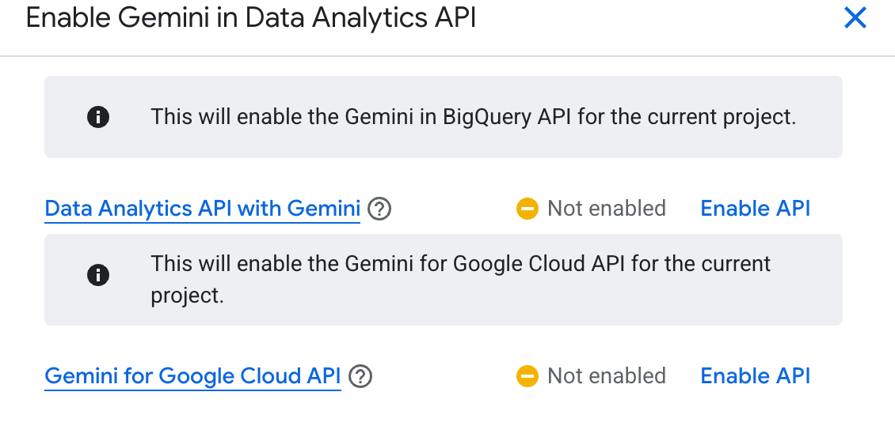

Select the BigQuery tables and views the agent can query.

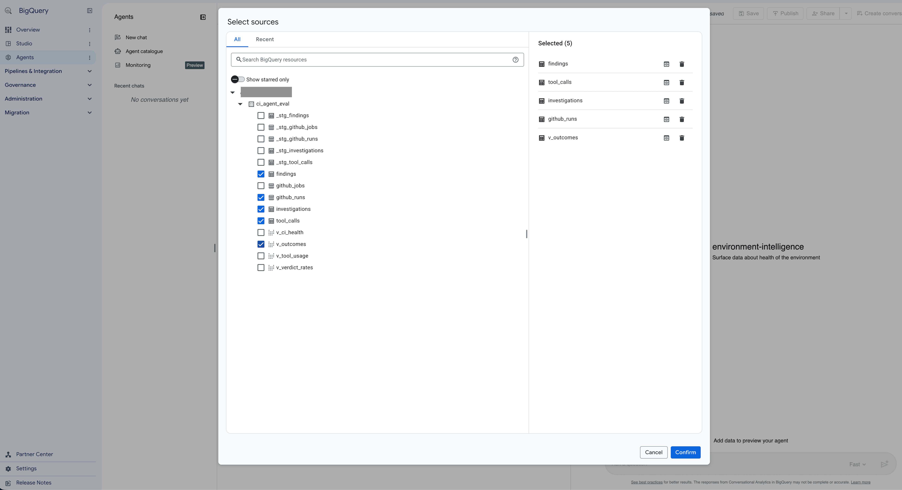

Save the agent in Conversational Analytics Studio and try a preview question.

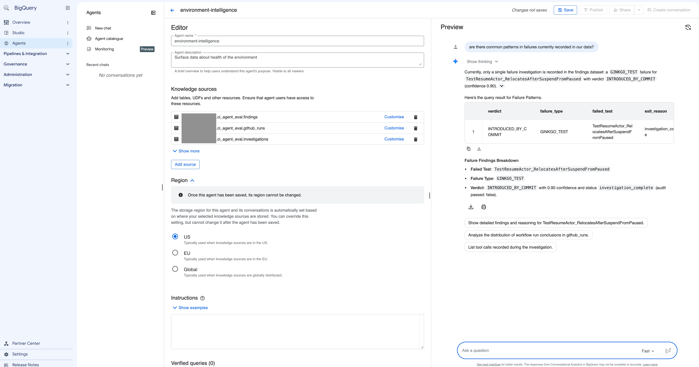

Choose publish channels, including Agent Registry so Gemini Enterprise can import it.

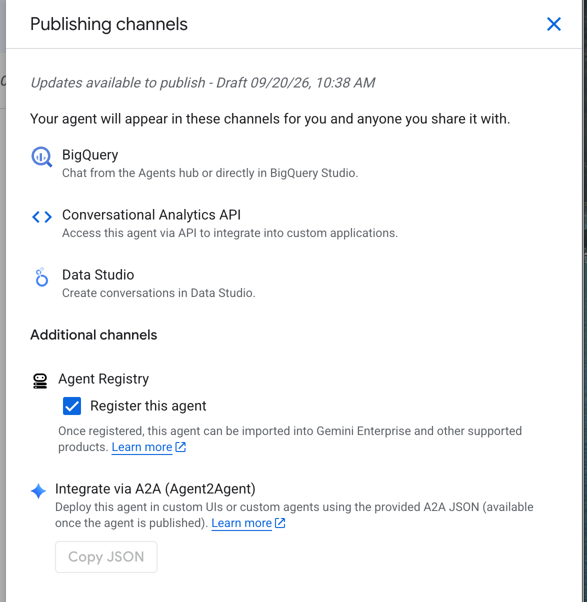

Confirm the agent is published to BigQuery, Conversational Analytics API, Data Studio, and Agent Registry.

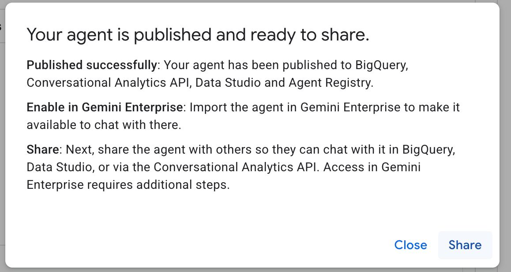

The publish dialog then shows the agent as registered in Agent Registry.

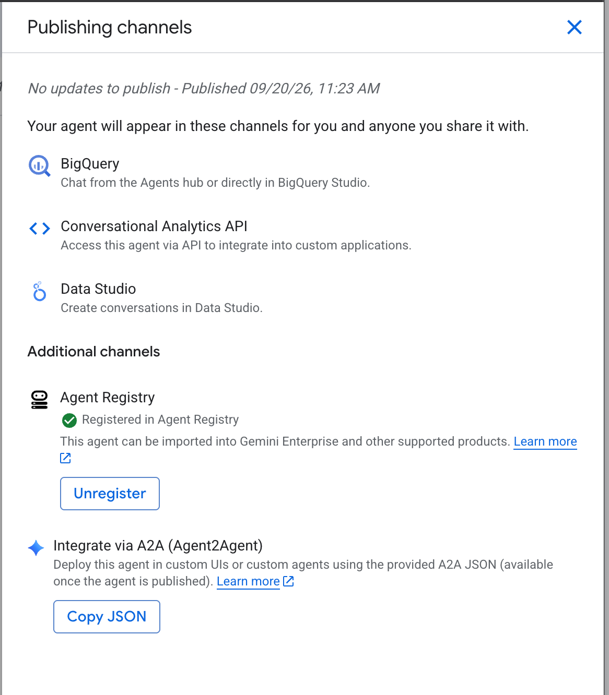

Open the registered agent in Agent Platform Registry to inspect its card and ADK snippet.

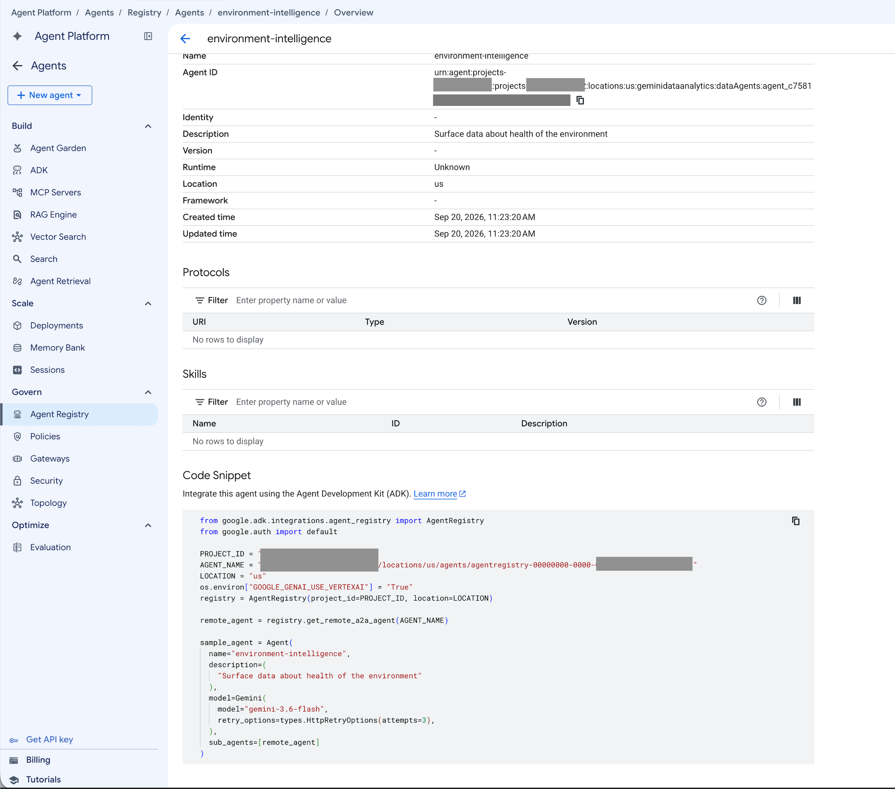

Import the agent into a Gemini Enterprise app from Agent Registry.

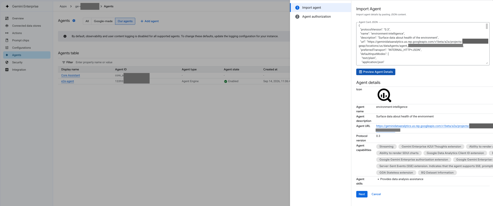

The agent appears under From your organization in the Gemini Enterprise Agents picker.

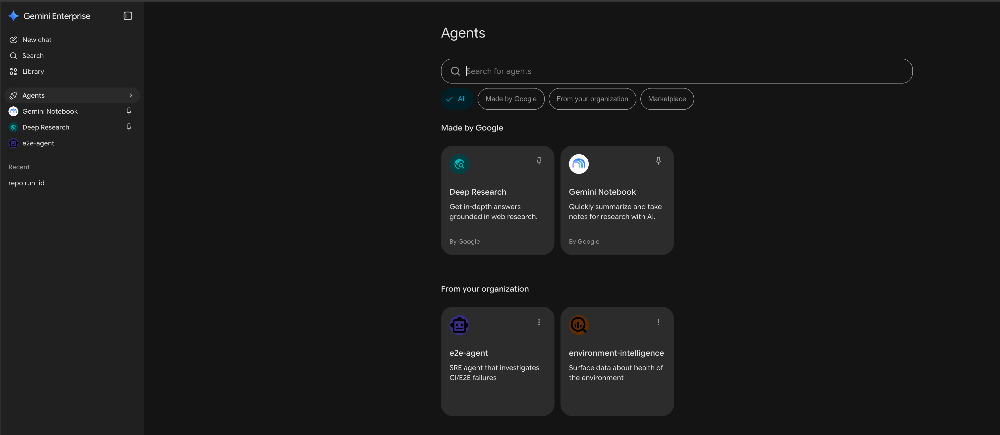

The first chat can prompt for extra authorization before queries run.

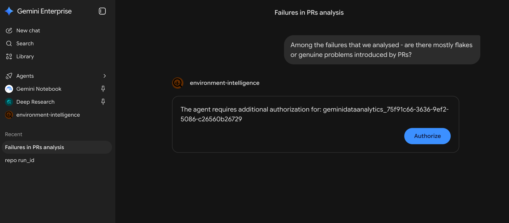

After auth, the agent retrieves table context, runs SQL, and answers.

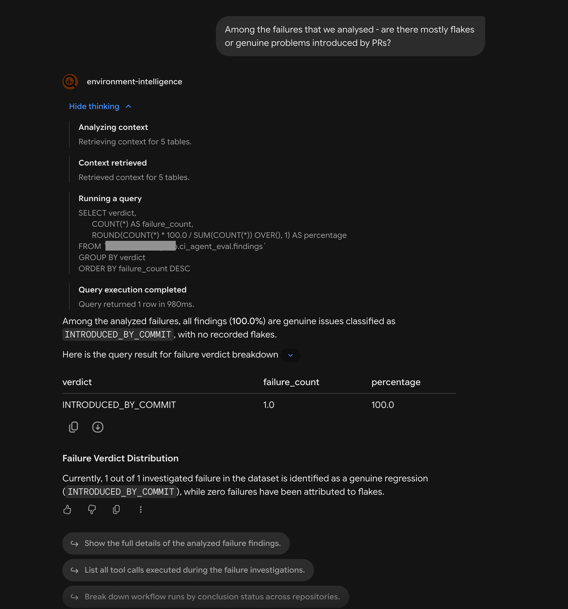

Follow-up questions can return structured result tables from the same dataset.

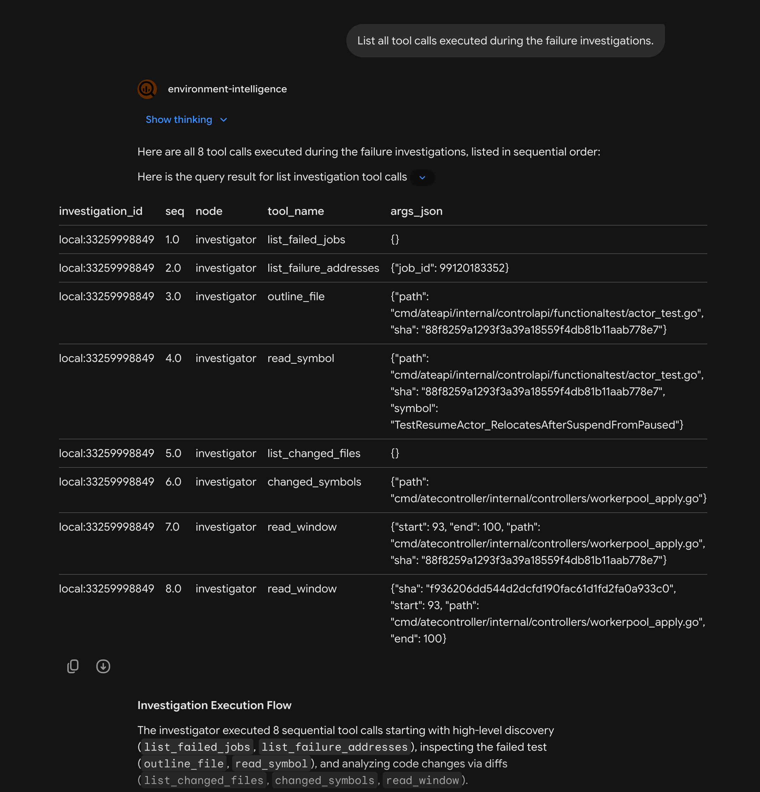

Gemini Enterprise can collect thumbs-up feedback on the answer.

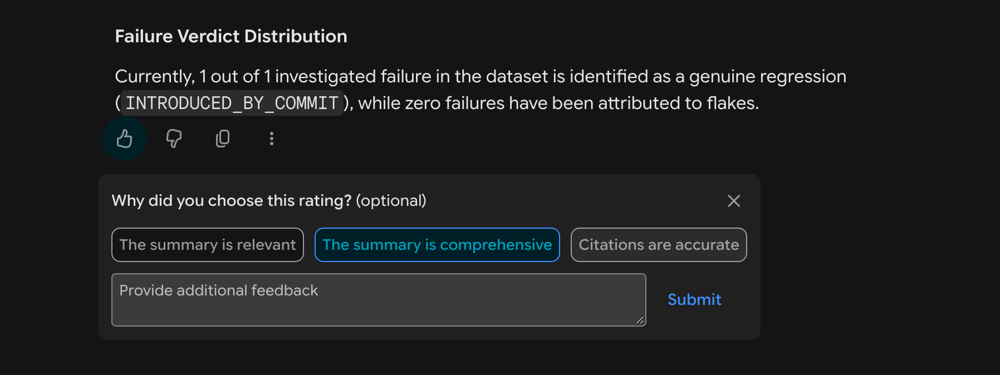

Later turns can keep using the same agent for other breakdowns of the data.

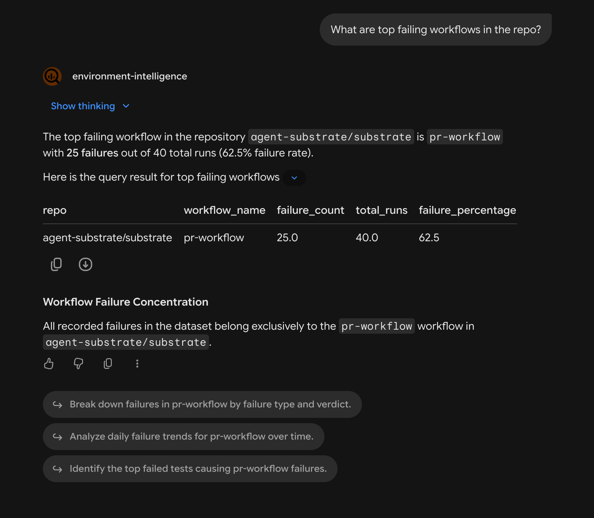
