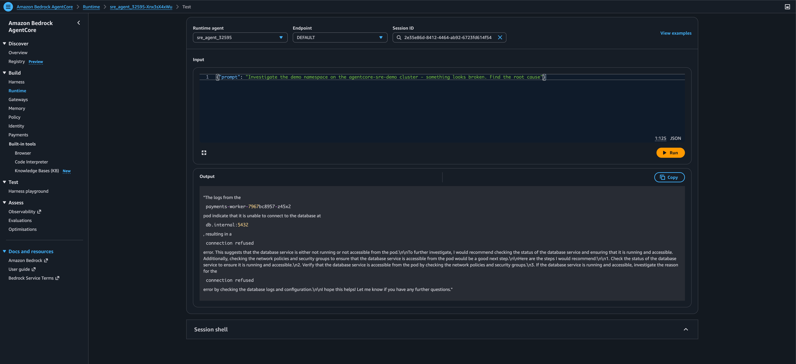
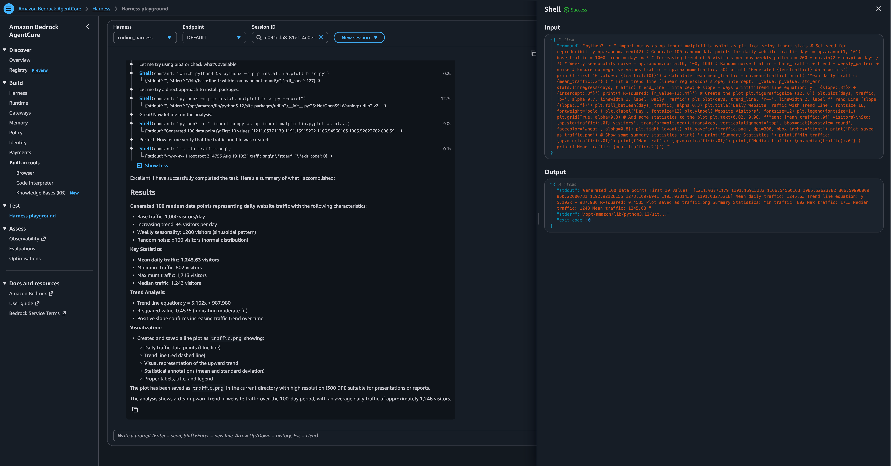
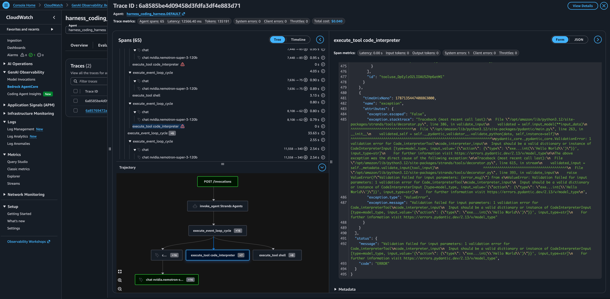

# AgentCore SRE agent, troubleshooting a real EKS cluster

A LangGraph agent, deployed to [Amazon Bedrock AgentCore Runtime](https://docs.aws.amazon.com/bedrock-agentcore/latest/devguide/what-is-bedrock-agentcore.html)
via **direct code deployment**, that investigates a real EKS cluster over the Kubernetes API — no Docker,
no AgentCore Gateway, no Cognito, no EC2, no SSL certs.

This intentionally skips the [awslabs SRE-agent sample](https://github.com/awslabs/agentcore-samples/blob/main/02-use-cases/01-conversational-agents/SRE-agent/README.md):
that sample needs an EC2 box, a domain + SSL certificate, an IDP (Cognito/Auth0/Okta), and AgentCore
Gateway just to stand up — and its "Kubernetes API" is a stub server returning synthetic JSON, not a real
cluster. Here the agent talks to a real EKS API via `kubectl`-equivalent calls, authenticated with its own
IAM execution role.

Base pattern adapted from the AgentCore samples repo:
`01-features/02-host-your-agent/01-runtime/01-hosting-agents/01-http-protocol/02-langgraph-bedrock`.

## Architecture

```
you ──invoke_agent_runtime()──▶ AgentCore Runtime (PUBLIC network mode)
                                   └─ LangGraph agent (Bedrock Claude)
                                        ├─ kubernetes-client tools ──▶ EKS API (public endpoint)
                                        │                                 cluster (Fargate, no EC2 nodes)
                                        └─ S3 tools ──▶ agentcore-artifacts-<account>-<region>
                                                           input/*    (fetch_input_from_s3)
                                                           reports/*  (upload_report_to_s3)
```

- **Auth to Bedrock**: the runtime's IAM execution role (`bedrock:InvokeModel`).
- **Auth to EKS**: `agent/eks_auth.py` presigns an `sts:GetCallerIdentity` call in pure Python (there's no
  `aws`/`aws-iam-authenticator` binary inside the direct-code-deploy runtime) and uses it as a Kubernetes
  bearer token — what `aws eks get-token` does under the hood.
- **What the role can do once authenticated**: governed by Kubernetes RBAC (`rbac/agent-rbac.yaml`), not
  IAM — read pods/logs/events/deployments, plus `delete_pod` and `restart_deployment` as limited write
  actions. Mapped via an EKS **access entry**, not the legacy `aws-auth` ConfigMap.
- **Network path**: the EKS cluster's public API endpoint is left open (default `0.0.0.0/0`) since
  AgentCore Runtime in `PUBLIC` network mode reaches it over the internet, not via VPC peering. Acceptable
  for a cluster you spin up and tear down for testing; not production practice.
- **Extra spans / S3 I/O**: there's no dedicated "artifact service" in AgentCore Runtime — `fetch_input_from_s3`
  and `upload_report_to_s3` in `agent/agent.py` are plain `boto3` calls wrapped as LangChain tools, same
  pattern as the Kubernetes tools. Because they run through `ToolNode`, they show up as their own spans in
  the runtime's built-in OTEL/X-Ray trace, same as every other tool call — no manual instrumentation needed.
  The execution role is scoped to `s3:GetObject`/`s3:PutObject` on a single bucket
  (`agentcore-artifacts-<account>-<region>`), created by `deploy.py`.

## Layout

- `cluster.yaml` — eksctl config: Fargate-only (no idle EC2 nodes), access-entry auth mode
- `broken-app/` — a deliberately crash-looping Deployment (`payments-worker`) in namespace `demo`, for the
  agent to diagnose
- `rbac/agent-rbac.yaml` — scoped ClusterRole/Binding for the agent's IAM role
- `agent/` — the LangGraph agent, deploy/invoke/cleanup scripts

## Usage

```bash
export CLUSTER_NAME=agentcore-sre-demo   # AWS_REGION defaults from `aws configure get region`

task cluster-up          # ~15 min — creates the Fargate EKS cluster
task seed-broken-app      # deploys the crash-looping demo workload

task deploy-agent          # deploys the LangGraph agent to AgentCore Runtime
# note the AGENT_ROLE_ARN printed at the end, then:
task grant-access AGENT_ROLE_ARN=<the arn above>

task invoke -- "Investigate the demo namespace, something looks broken"

task seed-input            # uploads a sample incident ticket to S3
task invoke -- "Fetch input/ticket.txt from S3 and investigate the reported issue, then upload your report"
```

## Teardown

```bash
task cleanup-agent   # deletes the AgentCore runtime, its IAM role, and the S3 code artifact
task cluster-down    # deletes the EKS cluster — stops the ~$0.10/hr control-plane charge
```
## Screenshots

### AWS SRE Agent Panel


### AWS Harness with Coding Interpreter


### AWS Coding Harness Trace Tree

