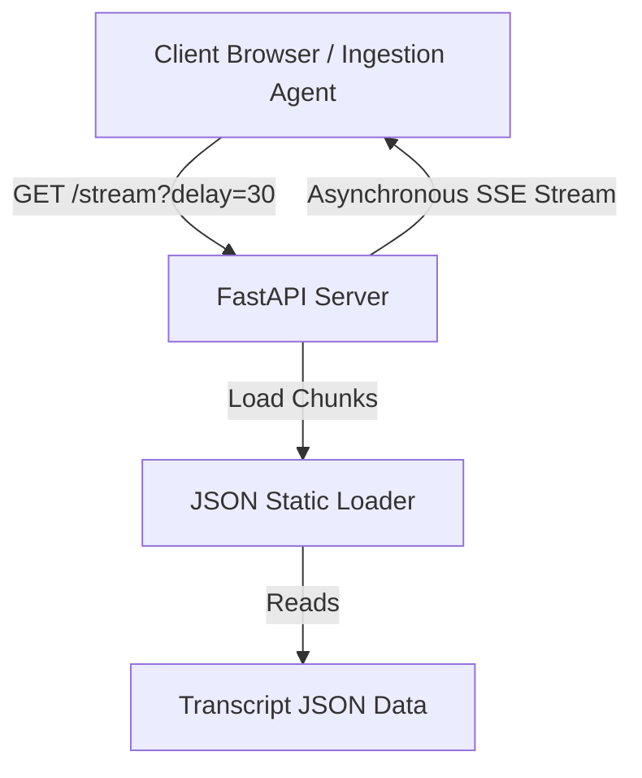

# Design: mock-transcript-streaming-server

## Approach
We will build a simple, lightweight asynchronous FastAPI application running on Uvicorn. The server will host a single `/stream` SSE endpoint utilizing FastAPI's `StreamingResponse`. 

To simulate real-time ingestion, we will parse a static JSON file containing pre-recorded transcript chunks. When a client connects, we will asynchronously yield these chunks formatted as SSE payloads, injecting a configurable `delay_seconds` (default 30 seconds, overrideable via query parameter) between yields.

## Architecture
The system consists of the following components:

## Key Decisions

### Decision: Data Storage
- **Options considered:**
  - Embedding chunks directly in the Python source.
  - Loading from an external JSON file.
- **Chosen:** Loading from an external JSON file (e.g. `data/transcript.json`).
- **Rationale:** Keeps Python codebase clean, allows users to easily swap dataset transcripts without modifying code.

### Decision: Delay Engine
- **Options considered:**
  - `time.sleep`
  - `asyncio.sleep`
- **Chosen:** `asyncio.sleep`
- **Rationale:** FastAPI is built on ASGI. Using synchronous `time.sleep` would block the entire event loop, preventing concurrency. `asyncio.sleep` yields execution, allowing concurrent clients to stream transcripts in parallel.

## Implementation Notes
- **SSE Format:** Server-sent events require messages to start with `data: ` and end with two newlines (`\n\n`).
- **Graceful Termination:** We will wrap the generator in a `try...finally` block. When a client disconnects, `StreamingResponse` stops consuming the generator, raising a `GeneratorExit` exception internally. The `finally` clause will allow us to catch client disconnects and log/cleanup gracefully.

## Testing Strategy
- **Manual Verification:** Use `curl -N http://localhost:8000/stream?delay=1` to verify transcript chunks stream in real-time.
- **Client Disconnection:** Initiate a curl request, terminate it midway, and verify that the server logs a clean client disconnection.
- **Invalid Parameters:** Verify that requesting negative delay defaults or throws error, and handle float parameter conversion.
