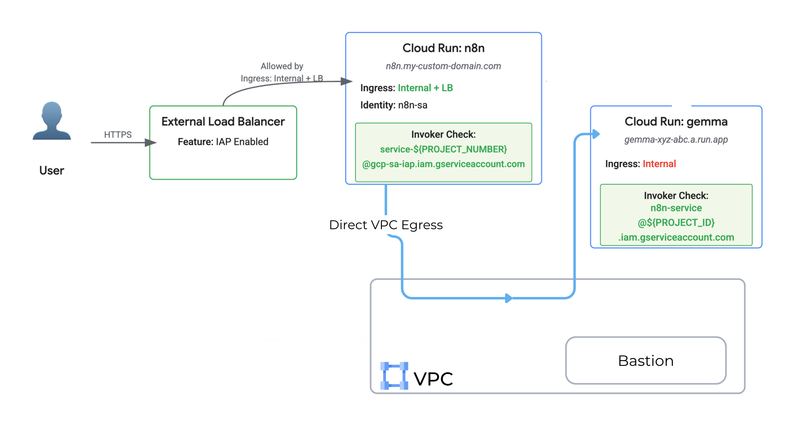

# Cloud Run N8N and LLM Demo

This project demonstrates deploying n8n workflow automation and LLM services on Google Cloud Run with private networking and secure access patterns.

This demo was built to accompany my presentation at Google Developer Group DevFest Brisbane 2025 conference. The slides can be found [here](https://olga-mir.github.io/Public-Speaking/2025.10.25__GDG-DevFest-Brisbane__Moving-to-Cloud-Run/)

## Architecture

- **VPC Network**: VPC in the same project as Cloud Run services
- **Cloud Run Services**: Internal-only services
- **Security**: Identity-Aware Proxy (IAP) for secure access

For demo purposes only, not required for working setup:
- **Bastion Host**: Compute Engine VM (with no public IP) for accessing Cloud Run services



## Prerequisites

- Google Cloud Project with billing enabled
- `gcloud` CLI installed and authenticated
- `task` (Taskfile) installed - [Installation guide](https://taskfile.dev/installation/)
- Required APIs enabled:
  - Compute Engine API
  - Cloud Run API
  - IAP API

## Environment Setup

Fill [./source-template](./source-template) with your values and source it.

## Tasks

List all tools
```
$ task --list
$ task help
```

###  📁 tasks/services.yaml (Cloud Run services - Both n8n & gemma)

  Deploy services:
  - task services:deploy-n8n - Deploy n8n
  - task services:deploy-gemma - Deploy gemma
  - task services:get-gemma-url - Get gemma URL / get n8s URL
  - task services:deploy-all - Deploy both services

###  📁 tasks/bastion.yaml

  - task bastion:setup - Create bastion host
  - task bastion:connect - SSH to bastion

###  📁 tasks/vpc.yaml (only once for VPC setup)

  - task vpc:setup - Create VPC network, subnets, firewall rules
  - task vpc:delete - Delete entire VPC (destructive)

# Network Configuration

### Subnet
- **VPC**: Defined by `$NETWORK` environment variable
- **Subnet**: Defined by `$SUBNETWORK` environment variable
- **CIDR Range**: 10.0.0.0/24
- **Private Google Access**: Enabled

### Firewall Rules
- **allow-iap-tunnel**: Allows SSH (TCP:22) from IAP range (35.235.240.0/20)
- **allow-internal-all**: Allows TCP/UDP/ICMP within 10.0.0.0/8

# Troubleshooting

## IAP Tunnel Connection Issues

If you can't connect to the bastion:

1. Verify IAP API is enabled:
   ```bash
   gcloud services enable iap.googleapis.com --project=$PROJECT_ID
   ```

2. Check your IAM permissions - you need `roles/iap.tunnelResourceAccessor`

3. Verify firewall rules allow IAP range:
   ```bash
   gcloud compute firewall-rules describe allow-iap-tunnel --project=$PROJECT_ID
   ```

# References

- [Cloud Run VPC Access](https://cloud.google.com/run/docs/configuring/vpc-direct-vpc)
- [Identity-Aware Proxy](https://cloud.google.com/iap/docs)
- [Cloud Run Security Best Practices](https://cloud.google.com/run/docs/securing/overview)

- [GDG DevFest Brisbane - Moving to Cloud Run - slidedeck](https://olga-mir.github.io/Public-Speaking/2025.10.25__GDG-DevFest-Brisbane__Moving-to-Cloud-Run/)
