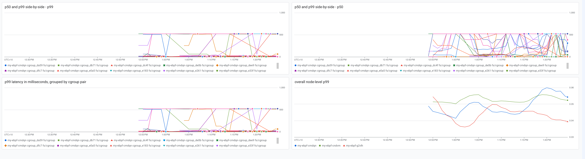

# About

Learning eBPF and the systems through eBPF lens at the same time.

# Experiments

## Hello World

basic hello world, just to setup the pipeline and build enviroment. Understanding eBPF basics. [./bpf-snippets](./bpf-snippets/)

## Noisy Neighbour

Following this article: https://netflixtechblog.com/noisy-neighbor-detection-with-ebpf-64b1f4b3bbdd
Learning more advanced eBPF programs and learning performance.

This article provides full eBPF code, however reading results and exporting them as a metrics to your own system is not covered.
This is the next step of this experiment.

# Setup and Prerequisites

This project uses GKE cluster to deploy the eBPF programs to as a daemonset.
Access to a GCP project is required. GKE setup is outside of scope of this project.

# Build

Simple hello-world eBPF program can be built on local with `task local-build-push`.
However for more advanced programs a linux system might be required. This project uses [lima](https://lima-vm.io/) with QEMU, to start Lima instance run:

```terminal
task lima-start
```

In its current state, lima config is minimal. This is to due to various errors when provisioning all the required tools during boot. For now tools are installed using [./lima-init.sh](./lima-init.sh) after the instance is running. This script will install docker, taskfile and gcloud allowing to build and push from within lima instance. This can be simplified in the future, TODO markers explain how.

Configure docker auth for process inside lima instance and then build image

```terminal
# on local:
$ task docker-auth
$ limactl shell ebpf-dev

# inside lima:
$ task lima-build-push
```

This task will push image to GCP GAR and from there it can be deployed to a GKE cluster as described in section below

# GKE

To explore eBPF on the host direclty is challenging in GKE because (rightfully so) there is no `apt` or `make`. It should be possible to download `bpftool` with `curl` but it would require building it from source to target COS env somehere which is not COS.

It is a lot easier to run `bpftool` in another container inside a priviledged pod. Technically would be even easier to have it in the app image itself, less secure.

Install `pbftool` for exploration:
```
k apply -f k8s/bpftool-daemonset.yaml
```

The cluster already has GKE Managed Prometheus running — playground-sre has a PodMonitoring and uses it. So the infra is ready.

## Deploy eBPF daemonset to GKE Cluster

These steps use infrastructure from  and workloads from

Deploy Daemonset with image built in previous step. This image is a go userspace program that loads eBPF program:

```
task lima-build-image   # or local-build-image if cross-compile works for you
task deploy-k8s
task deploy-monitoring  # deploys pod-monitoring.yaml
```

When this is proved working, this can be integrated into the playground projects.

## Generate load to create noisy neighbor pressure

### Option A — self-contained cpu-stressor DaemonSet (quickest)

Deploys `stress-ng` on every node. No other service needed.

```bash
kubectl apply -f k8s/cpu-stressor.yaml
kubectl top pods -l app=cpu-stressor   # confirm ~1–2 cores burning per node
```

Dashboard shows activity within ~1 minute (next scrape + 5 s poll).

Clean up when done:
```bash
kubectl delete -f k8s/cpu-stressor.yaml
```

**Why the CPU request is 10m:** the dev cluster nodes are 2-vCPU and nearly fully booked by system pods. The request only affects scheduling; the limit (4 CPU) is what stress-ng actually races for, which is what drives run-queue contention.

### Option B — perf-lab

If `perf-lab` is deployed, hit its CPU endpoint to saturate one replica's node:

```bash
# sustained CPU load — adjust QPS/duration to taste
fortio load -qps 50 -t 120s http://<perf-lab-svc>/cpu?iterations=100000

# fanout scenario spawns goroutines and creates scheduling churn
fortio load -qps 20 -t 120s http://<perf-lab-svc>/fanout?workers=20
```

## Track B — I/O stress + PSI

`bully-hog` (`stress-ng --cpu ... matrixprod`) is pure in-cache compute — it never touches
the block layer or the network stack, so it cannot test the "kernel threads / softirq /
writeback preempt the victim" theory. Track B adds two non-CPU stressors plus a Pressure
Stall Information (PSI) probe in the collector. See
[`docs/latency-anomaly-investigation.md`](./docs/latency-anomaly-investigation.md) §5 and
[`docs/proposal-non-cpu-noisy-neighbours.md`](./docs/proposal-non-cpu-noisy-neighbours.md) §5.

**Run the disk and network stressors one at a time.** They load different kernel
subsystems — disk drives writeback (`wb_workfn`) and block-queue contention, network drives
`NET_RX` / `ksoftirqd` — and running both at once makes attribution impossible. Disk is
the cleaner first test for the writeback-preemption story.

PSI needs the DaemonSet rebuilt and redeployed first, so the new `/host/proc/pressure`
hostPath mount and `PSI_PROC_PATH` env land:

```bash
task lima-build-image        # rebuild with psi.go
task deploy-k8s              # roll the DaemonSet
```

Then, per run:

```bash
task deploy-victim           # the pod to watch
task deploy-bully-io         # disk run: stress-ng --hdd/--iomix into an emptyDir
# ...observe for a few minutes, then...
kubectl delete -f k8s/bully-io.yaml

task deploy-bully-net        # network run (SEPARATE): stress-ng --sock/--udp
kubectl delete -f k8s/bully-net.yaml
```

What to watch:

- `ebpf_psi_pressure_ratio{resource="io", scope="node"}` and
  `{resource="io", scope="cgroup", cgroup="pod/<bully-io-uid>/..."}` — climb during the
  disk run; `{resource="cpu"}` climbs during the network run (softirq stealing CPU).
- `ebpf_psi_stall_seconds_total` — monotonic stall time, same labels minus `window`.
- `ebpf_runq_latency_nanoseconds` with the dashboard's `prev_cgroup` filter **widened** to
  include `root` / `system.slice/*`: if the theory holds, the victim's latency events start
  attributing to kernel threads (kworker, `ksoftirqd`, writeback) instead of a pod.
  `runqCollector` already emits `prev_cgroup` unfiltered, so no redeploy is needed for this
  — only the dashboard filter.

## View in Cloud Monitoring

Import `gcp-dashboard.json` into Cloud Monitoring → Dashboards. The dashboard requires two filters to be set before data appears:

- **ebpf_node** — the eBPF DaemonSet pod name (one per node). Scopes all charts to a single node; mixing nodes makes the data unreadable since scheduling is per-node.
- **cgroup_pod** — (Noisy Neighbour section only) the victim pod to investigate, in `pod/<uid-prefix>/<cid-prefix>` form.

To find a pod's cgroup label:
```bash
kubectl get pod <name> -o jsonpath='{.metadata.uid}' | cut -c1-8
# use result as uid-prefix in pod/<uid-prefix>
```

Key metrics:
- `ebpf_runq_latency_nanoseconds` — run-queue latency histogram, labelled by `cgroup` (scheduled pod) and `prev_cgroup` (pod it preempted). Buckets cover 1µs–8s.
- `ebpf_events_total` — confirms data is flowing from the eBPF ring buffer.
- `ebpf_psi_pressure_ratio` — Linux PSI stall percentage (0–100), labelled by `resource` (`cpu`/`io`/`memory`), `kind` (`some`/`full`), `window` (`avg10`/`avg60`/`avg300`), `scope` (`node`/`cgroup`) and `cgroup`. See "Track B" above.
- `ebpf_psi_stall_seconds_total` — cumulative PSI stall time in seconds (`total=` field), same labels minus `window`.

Dashboard panels use `histogram_quantile` over PromQL — not the raw histogram aggregation — to get accurate p50/p99 percentiles. Example noisy-neighbour query (who is preempting pod X?):
```promql
histogram_quantile(
  0.99,
  sum by (prev_cgroup, le) (
    rate(ebpf_runq_latency_nanoseconds_bucket{pod=~"<ebpf-pod>", cgroup=~"pod/<uid>/.*"}[5m])
  )
) / 1e6
```

## Outcomes

I've documented some learnings in [./outcomes](./outcomes) folder.

The project builds, deploys to GKE as a daemonset, collects run-queue latency data in eBPF maps, and exports it as Prometheus metrics via a ring buffer consumer in the Go userspace program.


*Note: this is in progress, but this is proof that the setup works and more analysis will follow soon.*

# Note on Cloud Run

Cloud Run was considered as a deployment target early on. It does not support eBPF and there is no public commitment to add support:
https://issuetracker.google.com/issues/206477810
