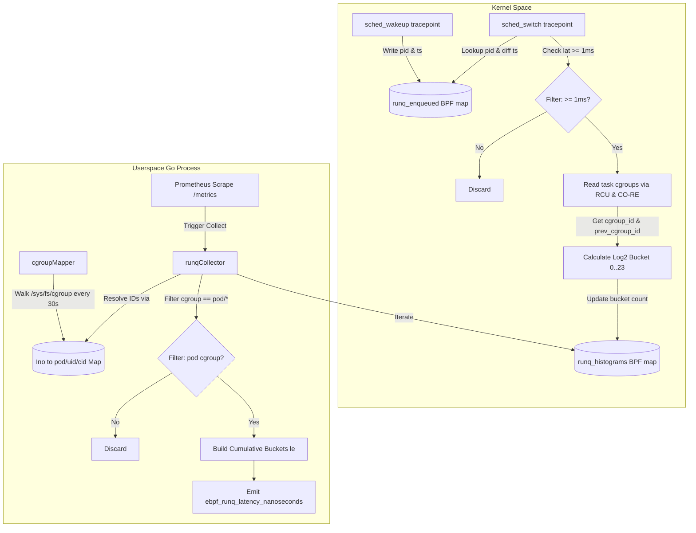

# eBPF Implementation, Metrics Export, and Filtering Analysis

## 1. Overview & Architecture

This experiment implements a noisy neighbor detection system using eBPF and Go. The system measures CPU run-queue scheduling latency for containers running under cgroupv2 and exposes labeled Prometheus metrics. 

When CPU contention occurs, a task waking up on a node must wait in the kernel run-queue before being scheduled onto an execution core. By measuring the duration between a task's enqueue time (`sched_wakeup`) and its actual CPU execution start time (`sched_switch`), the system quantifies scheduling delays and identifies which cgroups (pods/containers) cause preemption and interference.

---

## 2. eBPF Kernel Implementation (`bpf/noisy-neighbour.bpf.c`)

### 2.1 Tracepoints and Hook Points

The eBPF program hooks into two kernel raw tracepoints using BPF Type Format (`tp_btf`):

1. **`SEC("tp_btf/sched_wakeup")` (`tp_sched_wakeup`)**:
   - **Trigger**: Fired when a task moves into a runnable state and is placed onto a CPU run-queue.
   - **Operation**: Extracts the task Process ID (`pid`) using BTF core reads (`BPF_CORE_READ(task, pid)`) and records the current timestamp from `bpf_ktime_get_ns()`.
   - **Storage**: Stores the `(pid -> timestamp)` key-value pair in the `runq_enqueued` map with `BPF_NOEXIST` to prevent overwriting existing enqueued state.

2. **`SEC("tp_btf/sched_switch")` (`tp_sched_switch`)**:
   - **Trigger**: Fired when the CPU context-switches from a previously running task (`prev`) to a newly scheduled task (`next`).
   - **Operation**:
     1. Retrieves `next_pid` from the incoming `next` `task_struct`.
     2. Performs a lookup in `runq_enqueued` using `next_pid`. If absent, the event is ignored (missed enqueue).
     3. Calculates the run-queue latency: `runq_lat = bpf_ktime_get_ns() - enqueue_timestamp`.
     4. Deletes `next_pid` entry from `runq_enqueued`.
     5. Applies latency filtering (see Section 4).
     6. Resolves cgroup IDs for both `prev` and `next` tasks using `get_task_cgroup_id()`.
     7. Maps `runq_lat` to a log2 histogram bucket.
     8. Updates the `runq_histograms` map.

### 2.2 Cgroup Identification via CO-RE and RCU

To accurately attribute scheduling delays to specific container workloads, the eBPF code inspects task structure cgroup metadata safely:

```c
static __u64 get_task_cgroup_id(struct task_struct *task)
{
    struct css_set *cgroups;
    __u64 cgroup_id;

    bpf_rcu_read_lock();
    cgroups = BPF_CORE_READ(task, cgroups);
    cgroup_id = BPF_CORE_READ(cgroups, dfl_cgrp, kn, id);
    bpf_rcu_read_unlock();

    return cgroup_id;
}
```

- **Safety**: Wrapped in kernel RCU read lock helpers (`bpf_rcu_read_lock` / `bpf_rcu_read_unlock`) to safely dereference task cgroup pointers (`css_set`).
- **CO-RE (Compile Once – Run Everywhere)**: Uses `BPF_CORE_READ` to read nested struct offsets (`task -> cgroups -> dfl_cgrp -> kn -> id`) across different kernel versions without requiring target kernel headers on the host.

### 2.3 BPF Map Data Structures

1. **`runq_enqueued`**:
   - **Type**: `BPF_MAP_TYPE_HASH`
   - **Key**: `u32` (`pid`)
   - **Value**: `u64` (enqueue timestamp in nanoseconds)
   - **Capacity**: `20,000` entries (`MAX_TASK_ENTRIES`)

2. **`runq_histograms`**:
   - **Type**: `BPF_MAP_TYPE_HASH`
   - **Key**: `struct runq_hist_key` (`cgroup_id`, `prev_cgroup_id`, `bucket`)
   - **Value**: `u64` (event counter count)
   - **Capacity**: `50,000` entries (`MAX_HIST_ENTRIES`)

```c
struct runq_hist_key {
    u64 cgroup_id;       // Target task cgroup ID (scheduled on CPU)
    u64 prev_cgroup_id;  // Preempted task cgroup ID (switched out)
    u32 bucket;          // Logarithmic latency bucket index
};
```

---

## 3. eBPF Bucketing & Filtering

### 3.1 Kernel Filtering (`MIN_RUNQ_LAT_NS`)

To prevent map pollution and reduce overhead from ordinary scheduling churn:

- **Filter threshold**: `MIN_RUNQ_LAT_NS = 1,000,000` ns ($1\text{ ms}$).
- **Logic**: Any scheduling delay strictly less than $1\text{ ms}$ is discarded in the kernel before cgroup resolution and histogram map insertion:
  ```c
  if (runq_lat < MIN_RUNQ_LAT_NS) {
      return 0;
  }
  ```

### 3.2 Exponential Histogram Bucketing Logic

Latency is mapped into 24 logarithmic buckets mirroring Prometheus `ExponentialBuckets(1000, 2, 24)`:

- **Formula**: Bucket $b$ represents base unit $v = \frac{\text{lat\_ns}}{1000}$ ($\mu\text{s}$). The bucket index is calculated via right bit-shift operations:
  ```c
  static __always_inline u32 get_hist_bucket(u64 lat_ns)
  {
      u64 v = lat_ns / 1000;
      if (v == 0) return 0;

      u32 b = 0;
      while (v > 1 && b < (NUM_BUCKETS - 1)) {
          v >>= 1;
          b++;
      }
      return b;
  }
  ```
- **Bucket Boundaries**:
  - Bucket 0: $[0, 2\mu\text{s})$
  - Bucket 1: $[2\mu\text{s}, 4\mu\text{s})$
  - ...
  - Bucket 23 (overflow): $\ge 8.388608\text{ s}$

---

## 4. Userspace Cgroup Resolution (`main.go`)

### 4.1 Inode and `kernfs` Mapping (`cgroupMapper`)

Kernel cgroup IDs in eBPF correspond to directory inodes in `/sys/fs/cgroup` under cgroupv2. 

- **Background Refresh**: A background goroutine scans `/sys/fs/cgroup` every 30 seconds using `filepath.WalkDir`.
- **Stat Extraction**: Extracts `syscall.Stat_t.Ino` for each cgroup directory and maps it to a canonical label string.
- **Dual Lookup Strategy**:
  ```go
  func (m *cgroupMapper) name(id uint64) string {
      m.mu.RLock()
      defer m.mu.RUnlock()
      if label, ok := m.byIno[id]; ok {
          return label
      }
      // kernfs_node.id packs generation in upper 32 bits; inode lives in lower 32.
      if label, ok := m.byIno[id&0xFFFFFFFF]; ok {
          return label
      }
      return "unresolved"
  }
  ```
  This handles standard Linux cgroup inodes as well as GKE container runtime layouts where kernel `kernfs_node.id` packs generation numbers in upper bits.

### 4.2 Cgroup Path Label Formatting (`cgroupLabel`)

Raw cgroup paths (e.g., `/sys/fs/cgroup/kubepods.slice/kubepods-burstable.slice/kubepods-burstable-pod<uid>.slice/cri-containerd-<cid>.scope`) are parsed into low-cardinality metric labels:

- **Parsing Logic**: Searches path components for Kubernetes QoS slice prefixes (`kubepods-burstable-pod`, `kubepods-besteffort-pod`, `kubepods-guaranteed-pod`, `pod`).
- **Trimming**:
  - Pod UIDs are truncated to the first 8 characters (`shortID`).
  - Container IDs (stripping `cri-containerd-` / `docker-` and `.scope`) are truncated to 8 characters (`shortContainerID`).
- **Output Format**:
  - Pod container: `pod/<short-pod-uid>/<short-container-id>`
  - Pod cgroup root: `pod/<short-pod-uid>`
  - Fallback: last two path components or `"root"`.

---

## 5. Metrics Export & Filtering Pipeline

### 5.1 Custom Prometheus Collector (`runqCollector`)

Instead of iterating BPF map events in userspace and calling standard histogram `Observe()` calls—which would incur high memory allocation and CPU overhead—`runqCollector` directly reads bucket aggregates from BPF maps on every Prometheus scrape via `prometheus.Collector`.

1. **BPF Map Iteration**: Iterates over `RunqHistograms` map using `cilium/ebpf` iterator.
2. **Userspace Filtering**:
   - Discards zero values or invalid bucket indexes.
   - **Pod Filtering**: Filters out non-pod cgroups, retaining only target scheduled workloads starting with `"pod/"`:
     ```go
     cgroup := c.mapper.name(key.CgroupID)
     if !strings.HasPrefix(cgroup, "pod/") {
         continue
     }
     ```
3. **Bucket Alignment & Cumulative Sum Calculation**:
   - Prometheus cumulative histogram bounds (`le`) represent events $\le$ upper bound.
   - BPF bucket $b$ covers latency range $[1000 \cdot 2^b, 1000 \cdot 2^{b+1})$ nanoseconds.
   - The collector shifts counts into cumulative bucket totals ($L_b = \sum_{k=0}^{b-1} \text{count}_k$) and maps them to `bucketBoundsNs`.
   - Midpoint estimation is computed for the metric sum: $\text{sum} = \sum (\text{count}_b \cdot \text{midpoint}_b)$.

4. **Metric Generation**: Emits Prometheus constant histograms with labels `cgroup` (scheduled victim) and `prev_cgroup` (preempted context/noisy neighbor):
   ```go
   ch <- prometheus.MustNewConstHistogram(c.desc, totalCount, sum, cumulBuckets, p.cgroup, p.prev)
   ```

### 5.2 Scrape Endpoint & Total Event Tracking

- **HTTP Server**: Serves standard Prometheus metrics at `:9090/metrics` using `promhttp.Handler()`.
- **Global Event Counter (`ebpf_events_total`)**: A background goroutine polls `RunqHistograms` every 5 seconds to compute the delta in aggregate events across all buckets and updates a top-level Prometheus counter (`ebpf_events_total`) for telemetry health monitoring.

---

## 6. End-to-End Metric Flow Architecture


