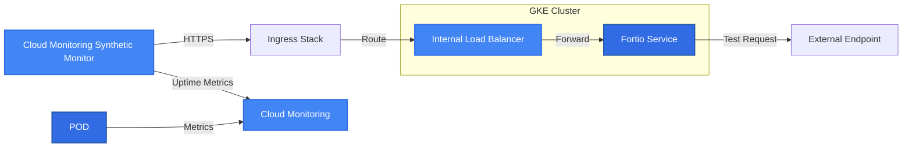
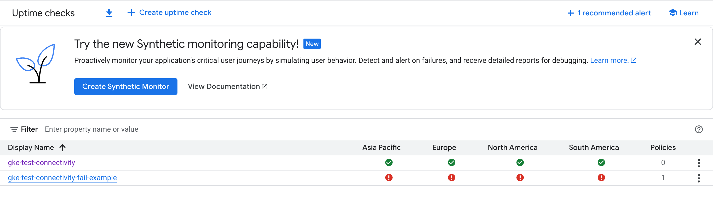
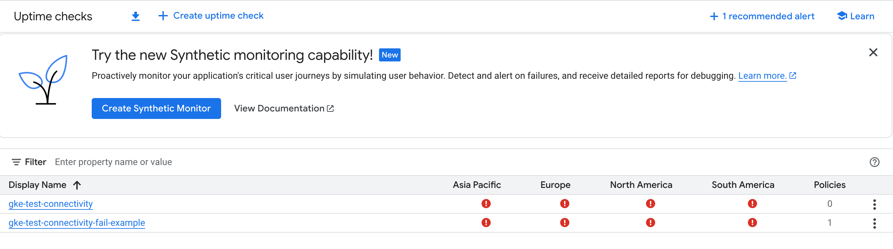

# Purpose

Exploring GCP Synthetic Monitoring and fortio capabilities.

First basic POC described below monitors outbound connectivity from a Kubernetes cluster by deploying a fortio image and configuring [Uptime Check URL](https://cloud.google.com/monitoring/uptime-checks) with URL params that will instruct fortio to call out to external service and return success or failure result to the monitor based on the outcome.

Note, that there are other monitoring types that potentially could be more tailored to a particular use-case such as [Kubernetes service](https://cloud.google.com/monitoring/api/resources#tag_k8s_service) check. (This page has a lot more different types of monitoring supported by GCM, they are not necessarily supported by Synthetic Monitoring feature, but they could be in the future)

# Prerequisites

1. Access to a GKE cluster to deploy fortio service with ingress.
2. Access to a GCP project with sufficient permissions to configure synthetic monitoring.

# Infrastructure



# Deploy

Deploy minimal fortio deployment, service and ingress:

```bash
k apply -f k8s-manifests/fortio-service.yaml
```

Deploy uptime checks:

```bash
./scripts/deploy-monitoring.sh
```
## Uptime Checks

https://cloud.google.com/monitoring/uptime-checks

list uptime checks

```bash
gcloud beta monitoring uptime list-configs
```

<details>
  <summary>See full 'describe' output of Uptime Checks for this experiment</summary>

```yaml
---
checkerType: STATIC_IP_CHECKERS
displayName: gke-test-connectivity
httpCheck:
  acceptedResponseStatusCodes:
  - statusClass: STATUS_CLASS_2XX
  path: /fortio/rest/run?url=google.com
  port: 80
  requestMethod: GET
monitoredResource:
  labels:
    host: <FORTIO_SVC>
    project_id: <REDACTED_PROJECT_ID>
  type: uptime_url
name: projects/<REDACTED_PROJECT_ID>/uptimeCheckConfigs/gke-test-connectivity--4b15lDJ-Tc
period: 60s
timeout: 20s
---
checkerType: STATIC_IP_CHECKERS
displayName: gke-test-connectivity-fail-example
httpCheck:
  acceptedResponseStatusCodes:
  - statusClass: STATUS_CLASS_2XX
  path: /fortio/rest/run?url=googlenosuchhost.com
  port: 80
  requestMethod: GET
monitoredResource:
  labels:
    host: <FORTIO_SVC>
    project_id: <REDACTED_PROJECT_ID>
  type: uptime_url
name: projects/<REDACTED_PROJECT_ID>/uptimeCheckConfigs/gke-test-connectivity-fail-example-7729izqEK8s
period: 60s
timeout: 60s
```

</details>


# Results

## Basic Test Setup

Fortio provides several useful utilities, including the ability to make HTTP requests to specified URLs and return the results to the caller.
In this demo, we created two uptime checks:

* A check that tests if Fortio can access a valid domain
* A check that attempts to access a non-existent hostname

When the Fortio service is running with internet access, the first check consistently succeeds while the second check fails with a 400 response code.

Valid URL fetch example:

```terminal
% time curl -s -w "%{http_code}" "http://$FORTIO_IP/fortio/rest/run?url=google.com" -o /dev/null
200curl -s -w "%{http_code}" "http://$FORTIO_IP/fortio/rest/run?url=google.com"   0.01s user 0.01s system 0% cpu 5.446 total
```

With invalid URL the response returned is 400 and the uptime check monitor will be constantly in failed state.

## Introducing Failure and Observing Results

To demonstrate failure detection, we make the "good" monitor fail by applying a network policy that blocks all traffic except pod, svc, vpc ranges and kube-dns, all other traffic is blocked as a result and fortio can't access internet.

After applying this policy, the previously successful endpoint now returns a 502 error after timing out:

```terminal
$ time curl -s -w "%{http_code}" "http://$FORTIO_IP/fortio/rest/run?url=google.com" -o /dev/null
502curl -s -w "%{http_code}" "http://$FORTIO_IP/fortio/rest/run?url=google.com"   0.01s user 0.02s system 0% cpu 1:00.07 total
```

The uptime check is configured with a 60-second period and 20-second timeout. Shortly after applying the network policy, the uptime check transitions to a failed status.

### Demo Visuals

#### Video

Skip middle part while it is waiting on monitor to pick up failure

#### Screenshots

[Video demo](https://drive.google.com/file/d/1369rE6ZecG0X5KSaIF7iCdhNxrk92Wwz/view?usp=sharing)

Initial state:



After applying policy and waiting a bit:


