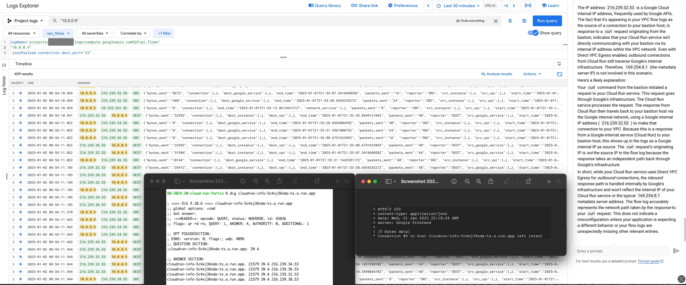
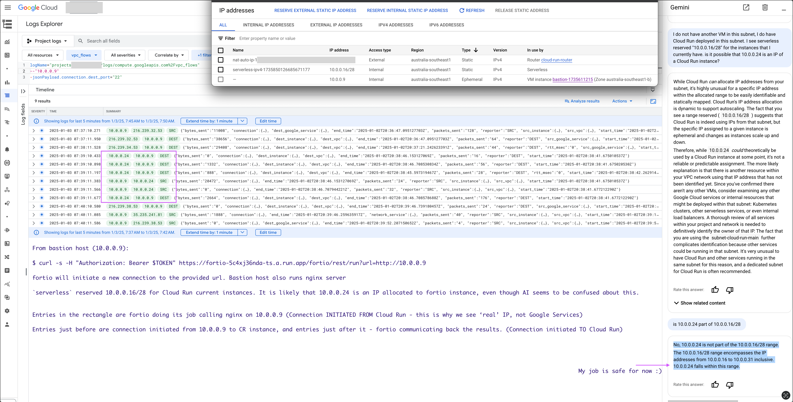

# Cloud Run Exploration

This folder contains tools to better understand how Cloud Run works. It consists of 2 main parts - `info` service and `fortio` service.
Info service is a golang app which reads a bunch of system information and returns it as a json to the caller.
Fortio is a helper service used to invoke Cloud Run apps and observe different behaviours.

## Exploring Cloud Run Environment

There is no way in Cloud Run to exec to a running container and explore the world through its eyes. This is why I (armed with AI of course) wrote a small Go app that reads system info and exposes it on an http endpoint. If there are better ways to reverse engineer Cloud Run do let me know.

Outputs collected from an instance are available in: [./docs/cloudrun-info-dump.json](./docs/cloudrun-info-dump.json) (note this is not the latest version yet, but will be uploaded soon)

## Cloud Run IP Allocation and Usage

This is notoriously obfuscated and almost no way to monitor usage of IP addresses used by Cloud Run instances using Direct VPC Egress.

### IP Allocation - Direct VPC Egress

`serveless` Service Agent reserves IPs for Cloud Run isntances in /28 chunks, but we have no visibility into how many of these IPs are really in use or even potentially in use (for future scale up). They will not even come up in Network Analyzer insights, and it turns out it is not easy to find out what IP is allocated to a running instance (even by queriing the instance environment from within)

WIP - visualisation and more details

### Connections

WIP but for now, a couple explainers below. In the screenshots, I included explanations from Gemini, which are to be taken with a grain of salt ;)

Connection initiated to Cloud Run is going through Google global frontend:

Connection initiated from Cloud Run sees an IP allocated from the user subnet (however it can also be 254.169.8.1)

## Common Tasks

`task help` to see all available operations

`task deploy-info` to build image, setup IAM and deploy `info` serevice Cloud Run
`task deploy-fortio` deploy fortio image to Cloud Run. This is useful tool to run different types of diagnostics and exploration from within the environment.

## License

Root repo: https://github.com/olga-mir/experiments/blob/main/LICENSE