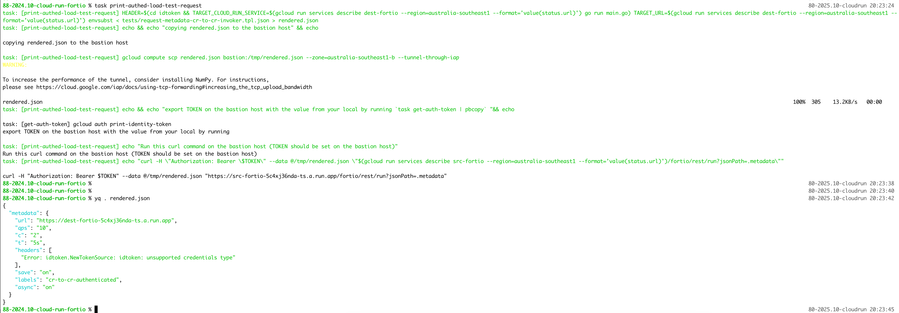

# Cloud Run Exploration

This folder contains tools to better understand how Cloud Run works. It consists of 2 main parts - `info` service and `fortio` service.
Info service is a golang app which reads a bunch of system information and returns it as a json to the caller.
Fortio is a helper service used to invoke Cloud Run apps and observe different behaviours.

# Quick Start

To see list of available commands:

```terminal
task help
```

# Experiment 1: Cloud Run Info

There is no way in Cloud Run to exec to a running container and explore the world through its eyes. This is why I (armed with AI of course) wrote a small Go app that reads system info and exposes it on an http endpoint. If there are better ways to reverse engineer Cloud Run do let me know.

Outputs collected from an instance are available in: [./docs/cloudrun-info-dump.json](./docs/cloudrun-info-dump.json) (note this is not the latest version yet, but will be uploaded soon)

Run this scenario with

```terminal
task deploy-info
```

# Expriment 2: Cloud Run to Cloud Run Scenarios

## Prepare Creds and Config

When both source and destination services are enforcing invoker check, you can pass token as a header (this is not secure and should only be done for shortlived projects and SA keys, the passed header will be printed in the log at the default fortio log level)

Unfortunatelly Google does not provide transparent auth for service accounts for Cloud Run invoker check, the process is described [in authenticating service-to-service docs](https://cloud.google.com/run/docs/authenticating/service-to-service#acquire-token)

Obtain SA key of the Service Account associated with the calling service and store it at `GOOGLE_APPLICATION_CREDENTIALS`, then run:

```terminal
task print-authed-load-test-request
```

This task will do a few things
1. get the url of the downstream service
2. build JWT token from provided SA key and the audience
3. create a config file to configure how source fortio service should call the destination service, including the credentials
4. copy this file to bastion



## Run The Load Test

Now everything is ready on the bastion host to invoke src-fortio and make it call dest-fortio:

```terminal
curl -H "Authorization: Bearer $TOKEN" --data @/tmp/rendered.json "https://<DEST_SVC_URL>/fortio/rest/run?jsonPath=.metadata"
```

## Viewing Result

`src-fortio` will respond with confirmation that it received and parsed the task. Performing the task async and saving results is part of the config file that was built in `print-authed-load-test-request` task.

```
{"message":"started","RunID":5,"Count":1,"ResultID":"<DATE_AND_ID>","ResultURL":"https://<SRC_FORTIO_URL>/fortio/data/2025-02-03-090226_5.json"
```

Results can be downloaded using `ResultsURL` from this response. they are also available in Logs Explorer.

# Experiment 2: IP Allocation in Direct VPC Egress

IP allocation in Cloud Run environment is hidden from end-user. There is no straight forward way to know the IP of the instances or reserve a range for a particular service. An instance can get any IP from subnet to which it is deployed. By design no assumptions should be made about instance IPs, this is intended and documented. More than the IPs themselves, it is crucial in Direct VPC Egress to keep track on IP usage. However there are no tools provided to do that. At the time of this writing Network Analyzer insigth does not cover IPs reserved by Serverless Agent.

`serveless` Service Agent reserves IPs for Cloud Run isntances in /28 chunks, but we have no visibility into how many of these IPs are really in use or even potentially in use (for future scale up). They will not even come up in Network Analyzer insights, and it turns out it is not easy to find out what IP is allocated to a running instance (even by querying the instance environment from within)

## Observations and Learnings

WIP but for now, a couple explainers below. In the screenshots, I included explanations from Gemini, which are to be taken with a grain of salt ;)

Connection initiated to Cloud Run is going through Google Global Frontend:


Connection initiated from Cloud Run sees an IP allocated from the user subnet (however it can also be 254.169.8.1)


## License

Root repo: https://github.com/olga-mir/experiments/blob/main/LICENSE
